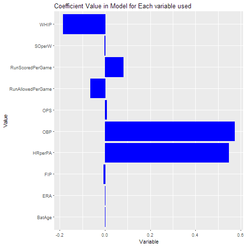

Baseball App Pitch
========================================================
author: Christopher Arnold
date: Juse 2nd, 2017
autosize: true

Overview
========================================================

Baseball is typically in the business of attempting to tie some sort of value to rate driven stats such as, but not limited to,

- On Base Percentage (OBP)
- Batting Average (BA)
- Earned Run Average (ERA)
- And many others...

The point of this application is to predict the win/loss record of teams in a given subset using this season's rate driven stats based on historical data of the same statistics.

Predicting the Outcome
========================================================
The predictions themselves will be shown in a simple table as shown below.


```r
kable(predictiontable[1:3,])
```


|Team | Predicted Wins| Predicted Losses| Current Wins| Current Losses|
|:----|--------------:|----------------:|------------:|--------------:|
|ARI  |             98|               64|           34|             22|
|ATL  |             71|               91|           22|             29|
|CHC  |             83|               79|           25|             27|
The most critical part of this app may be the plot showing the coefficients of the variables used in the model. This can give a sense of improving on a statistic will improve performance. This may be very useful information to a baseball team. An example of the plot is shown on the next slide.


Relative Importance of a Rate Stat
========================================================


```r
p <- getCoefficientPlot(1970,2016)
print(p)
```



<iframe src = "demo.html" style = "position:absolute;height:100%;width:100%"></iframe>

Other Things to Note
========================================================
The prediction model technique used is that of a boosted linear model. This was chosen because of the speed and accuracy associated with this technique.

The app has feautres as well that may be supplementary to what was previously listed:

- A geographical map to show location of listed subset
- Tables of the historical data and the current data

These pieces of information will be helpful for the user to get an overall sense of where the prediction is coming from.
